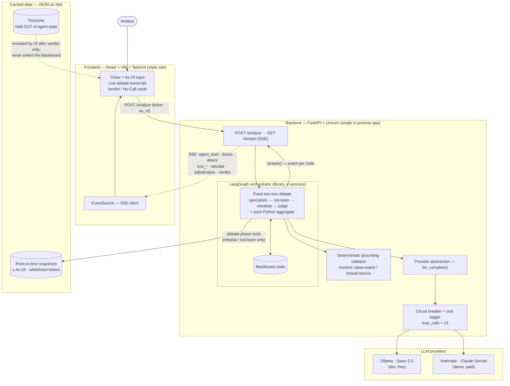

# Alpha Swarms — Architecture & Tech Stack

The consolidated technical design for the swarm-of-analysts research system.
Reflects the decisions in [`CONTEXT.md`](./CONTEXT.md) (domain language) and
`docs/adr/` (ADR 0001–0003). `PLAN.md` holds the week-by-week build plan.

---

## 1. System at a glance

One Python backend and one static frontend. Everything else is a library running
**in-process** — there is no separate orchestrator, queue, or database to host.



**Deployment:** for the deliverable (a recorded video) nothing is hosted — both
processes run on the laptop (`uvicorn` + `vite`). A public URL is a stretch goal
only; if used, the backend must go on an SSE-capable host (Railway/Render/Fly),
never serverless (Lambda/Vercel functions cut long-lived streams).

---

## 2. The agent graph (LangGraph)

A **fixed linear sequence** — no convergence loop, no round-count branching
(single rebuttal turn is the whole debate). LLM nodes are dark blue; the
`aggregate` node is **pure Python** (no LLM — the headline number is computed,
never authored; see ADR 0001).

```
START
  │  fan-out (parallel) — pre-sliced context, NO tools
  ├─▶ fundamentals_node ─┐
  ├─▶ sentiment_node     ├─▶ theses
  └─▶ technicals_node   ─┘
        │
        ▼  [grounding gate] — drop ungrounded evidence; a lens with ≥1 grounded item earns a vote
  red_team_node          — single call, sees all gated-in theses; MAY use tools
        │                  emits Attacks: {kind: "evidence"|"logical", ...}
        ▼  [grounding gate] — red-team counter-evidence held to the same bar
  fan-out (parallel) — MAY use tools (bounded 2–3 iters)
  ├─▶ rebuttal_node(fundamentals) ─┐
  ├─▶ rebuttal_node(sentiment)     ├─▶ proposed revised stances (advocacy, not final)
  └─▶ rebuttal_node(technicals)   ─┘
        │
        ▼
  judge_node             — rules which attacks landed; sets each Adjudicated Stance
        │                  (does NOT emit the headline number)
        ▼
  aggregate_node (pure)  — mean of gated adjudicated stances → bands → Verdict OR No Call
        │                  computes conviction (=|mean|), dissent band, N (voting lenses)
        ▼
       END
```

**State object (the blackboard, a `TypedDict`):** `ticker`, `as_of`, `theses`,
`attacks`, `rebuttals`, `adjudicated_stances`, `evidence_pool`, `phase`.
Agents read/write the shared blackboard; we pass *summarized* theses between
nodes, not raw reasoning, to bound token cost.

---

## 3. Request lifecycle & the SSE event contract

`graph.stream(...)` yields state after each node; the backend relays each as a
typed SSE event. One event per **agent step** (not token-by-token), with a small
inter-event delay so the debate is readable.

| Order | Event `type` | Key fields |
|---|---|---|
| 1 | `agent_start` | `agent` |
| 2 | `thesis` | `agent`, `stance` (−1…+1), `evidence[]` (each grounded or dropped) |
| 3 | `attack` | `agent:"red_team"`, `target`, `kind:"evidence"\|"logical"`, `critique`, `counter_evidence[]` |
| 4 | `tool_call` / `tool_result` | `agent`, `tool`, `args` / `data` (debate phase only) |
| 5 | `rebuttal` | `agent`, `proposed_stance` (advocacy, not final) |
| 6 | `adjudication` | `agent`, `adjudicated_stance`, `attacks_landed[]` |
| 7 | `verdict` | `aggregate_stance`, `direction`, `conviction`, `dissent`, `voting_lenses` — **or** `direction:"no_call"`, `reason` |

The **Outcome** (what actually happened after `as_of`) is never in this stream —
it lives in a separate object the UI reveals only after the verdict (ADR 0002).

---

## 4. Scoring pipeline (deterministic, post-adjudication)

All arithmetic, reproducible for replay runs:

1. Each gated-in specialist has a Judge-set **Adjudicated Stance** ∈ [−1, +1].
2. **Aggregate Stance** = plain mean of those stances (one lens, one equal vote).
3. **Direction** = band(Aggregate): `> +0.25` Bull · `−0.25…+0.25` Neutral ·
   `< −0.25` Bear. `|Aggregate| > 0.75` flags "high-conviction". (Refinitiv Hold
   convention, tunable.)
4. **Conviction** = `|Aggregate|` → 0–1, always shown beside **N** (voting lenses).
5. **Dissent** = spread of the voting stances → **Low / Med / High** band.
6. **Quorum:** fewer than 2 gated-in lenses ⇒ **No Call** (honest abstention).

---

## 5. Grounding & tools (deterministic; symmetric)

**Grounding** is a deterministic gate on whether a claim may enter scoring
(ADR 0001) — two tiers:

- **Numeric** (Fundamentals, Technicals): `{claim, citation_key, cited_value}` —
  `citation_key` must resolve in the snapshot **and** `cited_value` must match
  within tolerance.
- **Textual** (Sentiment/News): `{claim, source_id, quoted_span}` — `source_id`
  must resolve to a real cached source (hard gate); an exact-substring
  `quoted_span` earns a "verified quote" badge (not a gate).

Red-Team attacks are held to the **same** bar: an attack lands only if it is
grounded counter-evidence or a valid logical flaw — never unsupported doubt.

**Tools** (ADR 0003) read only the cached snapshot, never live APIs — so the
`as_of` filter is enforced *inside* the tool and future-leakage is impossible by
construction. Scope: initial theses use pre-sliced context (no tools); **only
rebuttals and the Red-Team** call tools, in a loop bounded to 2–3 iterations.

| Tool | Returns (from cached snapshot, ≤ as_of) |
|---|---|
| `get_financials(ticker, as_of)` | last *reported* statements before as_of |
| `get_price_history(ticker, as_of, window)` | OHLCV series truncated at as_of |
| `get_news(ticker, as_of, limit)` | headlines with `source_id` + publish date |

---

## 6. Point-in-time data model (ADR 0002)

A **Snapshot** is a curated JSON bundle per `(ticker, as_of)` on a whitelist of
2–3 hand-picked pairs. Every datum is stamped with an availability date and hard-
filtered to `≤ as_of`; fundamentals are the last *reported* figures (checked by
filing date, not period). The **Outcome** is stored separately and never reaches
the blackboard. Uncached tickers are refused, never live-fetched.

---

## 7. Tech stack

| Layer | Choice | Why / notes |
|---|---|---|
| **Frontend framework** | React + **Vite** + TypeScript | Fast dev server; TS keeps the SSE event union honest. Streamlit is the time-crunch fallback. |
| **Styling** | Tailwind CSS | Fast, no bespoke design system needed for a demo. |
| **SSE client** | native `EventSource` | Zero-dep, built for server→client streaming. No websocket/library needed (traffic is one-way). |
| **Frontend state** | `useReducer` over the event stream | Events are a reducible log → verdict cards. No Redux/Zustand — not enough state to justify a library. |
| **Backend framework** | **FastAPI** + **Uvicorn** (ASGI) | Async fits SSE; holds the API key server-side. |
| **SSE server** | `sse-starlette` `EventSourceResponse` | Correct SSE framing + disconnect handling over raw `StreamingResponse`. |
| **Orchestration** | **LangGraph** (library) | Stateful graph maps onto the fixed debate; `.stream()` yields per-node state → SSE for free. Ignore the paid LangGraph Platform. |
| **Structured I/O** | **Pydantic** models | Thesis/Stance/Evidence/Attack/Verdict schemas — enforce clean JSON from agents and make the grounding validator a typed function. Critical against flaky local-model JSON. |
| **LLM (demo)** | Anthropic SDK → **Claude Sonnet** (`claude-sonnet-5`) | Specialists + Judge all on Sonnet for the budget (no Opus). *(PLAN's budget was estimated on Sonnet-class $3/$15 pricing — confirm the exact model/pricing before the paid runs.)* |
| **LLM (dev)** | **Ollama** — Qwen 2.5 7B/14B | Free, local; Qwen is best at structured JSON + tool-calling. Groq free tier as no-local-compute fallback. |
| **Provider abstraction** | thin `llm_complete()` / `llm_complete_with_tools()` wrapper | One config flag (`LLM_BACKEND = ollama|claude`) routes calls. Develop on Ollama, flip to Sonnet near demo. ~20 min to build. |
| **Prompt caching** | Anthropic `cache_control` | On system prompts + snapshot slices from day one (~90% off cached input). |
| **Data ingestion** | yfinance / FMP / Alpha Vantage (+ **pandas**) | Used **offline** to build snapshots, never during a run. |
| **Data storage** | JSON files on disk | 2–3 curated snapshots; no database needed. |
| **Testing / cost control** | mock provider | Hardcoded-JSON provider builds the skeleton + SSE pipeline for free before spending a token. |
| **Containerization** | None (skip Docker) | Run `uvicorn` + `vite` directly; add Docker only on environment drift. |

---

## 8. Safeguards (build before any agent)

- **Circuit breaker** in the provider wrapper: `max_calls ≈ 15` per run (covers
  debate tool iterations) + a per-agent tool-iteration cap (2–3). Kill switch on
  breach — one runaway tool loop can eat a third of the $15 budget.
- **Per-run cost logging** — print estimated `$` after every execution.
- **Global spend counter** — treat $15 as a hard wall.
- **Replay mode** — a flag that re-streams a recorded good run's events through the
  same SSE pipeline; $0 in credits, lets you re-shoot a clean take.

---

## 9. Non-goals (cut for the 1-week / $15 scope)

Multi-round debate & variance-based convergence · Macro agent · backtest/eval
harness · live data fetching · autonomous tool use on the *initial* thesis ·
arbitrary (non-whitelisted) ticker input · cloud hosting. Each is an honest
"what we'd scale to," not a hidden limitation.
